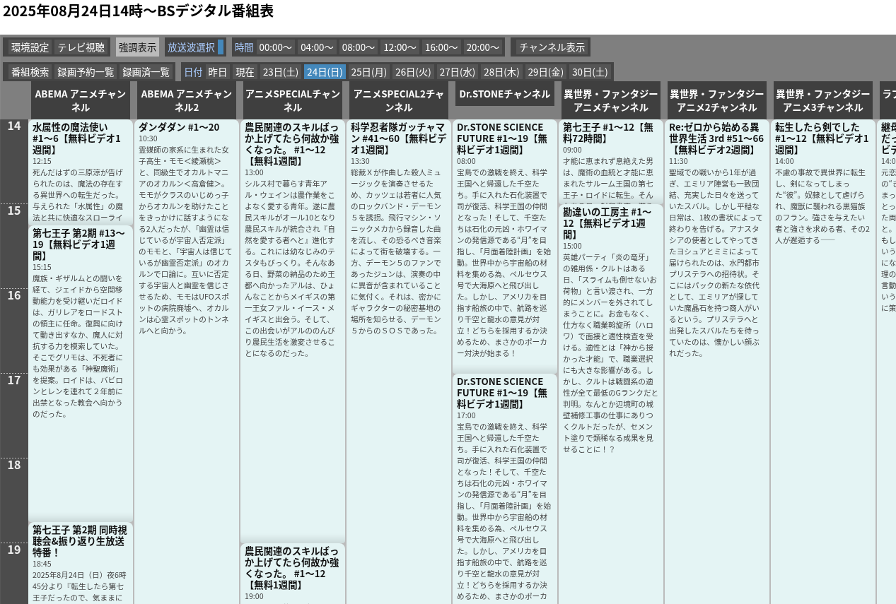
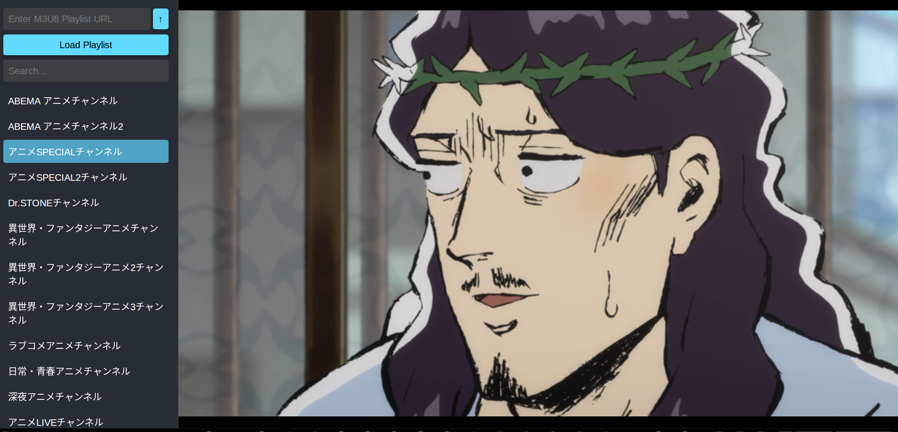

# iptvrec

epgrecをもとにm3uファイルを読み込んで動作する録画システムです。
ブラウザで録画ファイル,ライブストリームを視聴できるように改造しています。
m3uは自分で探してください

## スクリーンショット



## 必要なもの
- PHPが動作するWebサーバー環境
- mysqlなどのDB
- ffmpeg
- 場合によってはyt-dlpやstreamlink
- at,cronが使える環境

## インストール

1. サーバーに全部展開
2. DBにアカウントとDBを作成 
3. ブラウザでhttps://(your-server)/iptvrec/install/step1.php にアクセス
4. チューナー設定は適当でい良いです。同時録画できるようにチューナーの数は多めに。
5. プレイリストの設定にm3uのURLを設定
6. cronでgetepg.phpを適当な間隔で呼び出す

## ブラウザで視聴する
1. 番組表の上部の"テレビ視聴"ボタンをクリック
2. 左のチャンネルリストをクリック

録画済みリストでタイトルをクリックで録画視聴もできます

### CORS PROXY
チャンネル動画の配信サーバーがCORS対応していない場合は、ブラウザで視聴できません。
一応、cors proxyは用意してあるので、自己責任で。

```webapp.html
const proxy=true;
```


## 参考にしたもの
- [epgrec3](https://www.mda.or.jp/epgrec/)
- [html-iptv-player] (https://github.com/dbghelp/html-iptv-player)
- [php-cross-domain-proxy](https://github.com/softius/php-cross-domain-proxy)